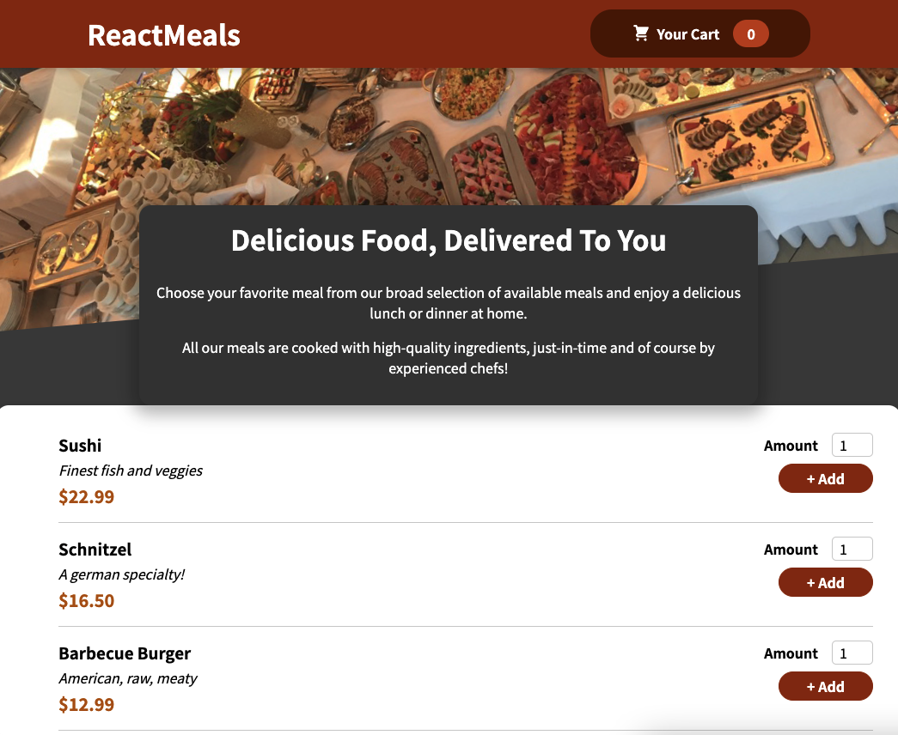
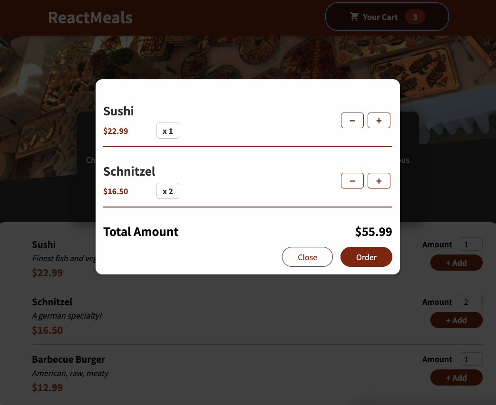

# Food Order App

* #### writer : crystal Lee

* #### written at : 2022-05 

* #### source : [Udemy] React Perfect Guide Sec.11

---

* <strong>Skills</strong>
    * React 

 

* <strong>What I learn</strong>
    * useState  (for CSS Effect in condition)
    * useEffect  (for CSS Effect in condition)
    * useReducer 
    * useContext 
    * useRef 
        * & forwardRef 

 

* <strong>Features</strong>
    1. Banner Image & Banner Message
    2. Item List 
        * Item Detailed Information
        * Amount Selector
        * Add Item Button 
    3. Cart
        * Show Modal When Clicked
        * Show 'Added Item List' & 'Total Amount'
        * Close Button & Order Button
        * Bump Animation When Item is Added

